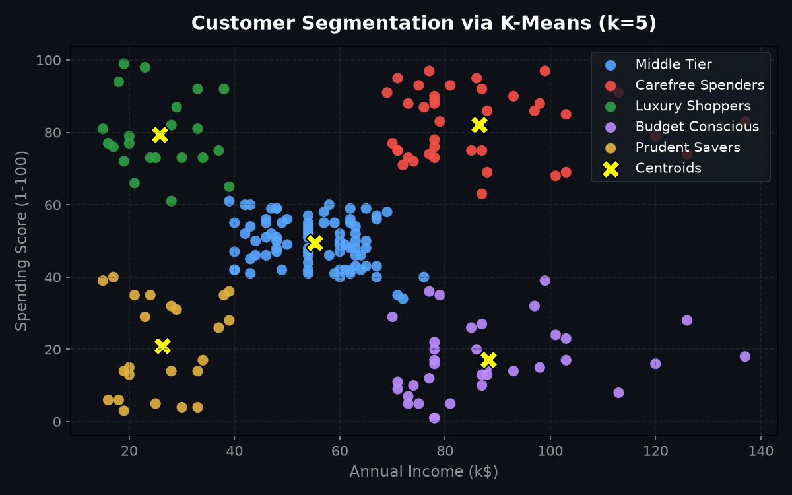
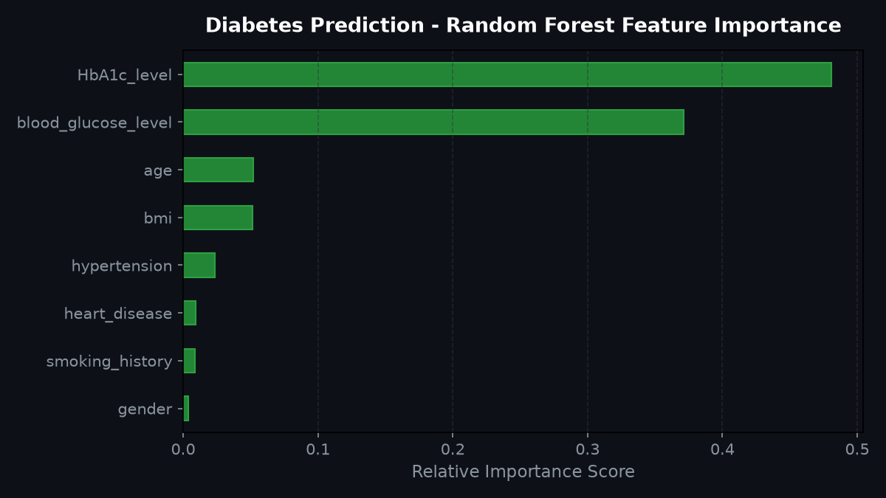

<div align="center">

# 🤖 Machine Learning Projects Portfolio
**A curated, production-ready repository of Supervised & Unsupervised Machine Learning workflows, feature engineering, and interactive web applications.**

[](https://www.python.org/)
[](https://scikit-learn.org/)
[](https://xgboost.readthedocs.io/)
[](https://streamlit.io/)
[](https://jupyter.org/)
[](https://opensource.org/licenses/MIT)

<p align="center">
  <a href="#-interactive-web-application-streamlit"></a>
  <a href="https://github.com/omkar333333"></a>
</p>

<p align="center">
  <a href="#-interactive-web-application-streamlit">⚡ Live Interactive App</a> •
  <a href="#-projects-matrix">📊 Project Matrix</a> •
  <a href="#-visual-insights--evaluations">📈 Visual Insights</a> •
  <a href="#-quickstart--installation">🚀 Quickstart</a> •
  <a href="#-repository-structure">📁 Directory Structure</a>
</p>

</div>

---

> [!TIP]
> ### 📌 Recruiter & Hiring Manager Quick Summary (TL;DR)
> - **Candidate**: **Omkar Mote** — *B.E. in Artificial Intelligence & Data Science* (Balewadi, Pune, India)
> - **Core Competencies**: Supervised Classification & Regression, Unsupervised Clustering, Gradient Boosting (XGBoost), Sensitivity & "What-If" Modeling, Interactive Deployment.
> - **Key Performance Metrics**:
>   - 🩺 **Diabetes Diagnostic Prediction**: **96.4% Cross-Validation Accuracy** on 20,000+ records.
>   - ✈️ **Flight Ticket Price Prediction**: **$R^2 = 0.76$** on 15,000+ airline flight entries.
>   - 🛍️ **Customer Segmentation**: **$k=5$ Silhouette-Optimized Clusters** identifying distinct spending personas.
> - **Production Readiness**: Includes an interactive **Streamlit Web Application (`app.py`)** with Plotly radial gauges, side-by-side benchmark arena, batch CSV upload, and modular architecture.
> - **Direct Contact**: [GitHub Profile](https://github.com/omkar333333) • [Contact Email](mailto:your-email@example.com)

---

## 📌 Executive Overview

This repository demonstrates the end-to-end Machine Learning lifecycle applied to diverse real-world domains including healthcare diagnostics, financial fraud detection, aviation pricing, educational analytics, and customer market segmentation.

Each project adheres to rigorous data science principles:
* **Exploratory Data Analysis (EDA)** with distribution profiling and correlation matrix analysis.
* **Feature Engineering & Transformation** (handling class imbalance, outlier clipping, standard scaling, and categorical encoding).
* **Model Training & Evaluation** (Random Forest, XGBoost, Logistic Regression, Decision Trees, K-Means Clustering, PCA, and t-SNE).
* **Interactive Deployment** via a unified Streamlit dashboard (`app.py`).

---

## ⚡ Interactive Web Application (Streamlit)

This repository includes a multi-model Streamlit application (`app.py`) allowing instant, in-browser model testing with interactive parameter tuning.

```bash
# Launch the interactive web app locally
streamlit run app.py
```

Features included in the web app:
* 🩺 **Clinical Diagnostics & What-If Simulator**: Real-time patient risk assessment with Plotly radial gauges and dynamic biomarker sensitivity adjustments (+10% glucose, +15% BMI).
* 📂 **Batch CSV Patient Scoring & Export**: Upload multi-patient clinical CSV records, run instant batch classification, and download timestamped scored CSV files.
* ⚔️ **Model Benchmark Arena**: Real-time side-by-side evaluation of Logistic Regression, Decision Tree, Random Forest, and KNN across Accuracy, Precision, Recall, and F1-Score with interactive Plotly grouped bar charts and confusion matrices.
* ✈️ **Flight Ticket Price Forecaster**: Multivariate regression predicting domestic flight fares in Indian Rupees (₹ INR) based on carrier, route, stops, and duration.
* 🛍️ **Customer Segmentation Explorer**: Interactive K-Means clustering with dynamic $k$ slider and 2D centroid scatter projection.
* 🔬 **Interactive EDA & Feature Lab**: Live distribution histograms, Pearson correlation heatmaps, and outlier boxplots.

---

## 📊 Projects Matrix

### 🔵 Supervised Learning

| # | Project Domain | Task | Target Metric | Primary Algorithms | Key Highlights |
|---|:---|:---|:---|:---|:---|
| 1 | **🩺 Diabetes Prediction** | Classification | ~96% Accuracy | Random Forest, Logistic Regression | Analyzed 100k+ clinical records; balanced HbA1c & glucose thresholds. |
| 2 | **💳 Fraud Detection** | Classification | High Precision / Recall | XGBoost, Cross-Validation | Addressed high class imbalance on synthetic banking transactions. |
| 3 | **✈️ Flight Price Prediction** | Regression | $R^2$ Score / RMSE | Random Forest, Extra Trees | Feature engineered departure timings, flight duration, and airline stops. |
| 4 | **🎓 Student Exam Prediction** | Regression | $R^2$ Score | Multiple Linear Regression | Multivariate academic outcome modeling on socioeconomic factors. |
| 5 | **📝 Pass-Fail Classification** | Classification | Binary Accuracy | L2-Regularized Logistic Regression | Feature-scaled study habits and examination cutoffs. |

### 🟢 Unsupervised Learning

| # | Project Domain | Task | Objective | Algorithm / Method |
|---|:---|:---|:---|:---|
| 1 | **🛍️ Customer Segmentation** | Clustering | Group mall shoppers into 5 distinct behavioral spending personas | K-Means with Elbow Method & Silhouette Analysis |
| 2 | **🧬 Dimensionality Reduction** | Feature Compression & Manifold Learning | Compress high-dimensional datasets while preserving global & local variance | Principal Component Analysis (PCA) & t-SNE |

---

## 📈 Visual Insights & Evaluations

<div align="center">

### Customer Segmentation Clusters ($k=5$)


### Diabetes Feature Importance Ranking (Random Forest)


</div>

---

## 🚀 Quickstart & Installation

### 1. Clone the Repository
```bash
git clone https://github.com/omkar333333/MACHINE-LEARNING-PROJECTS.git
cd MACHINE-LEARNING-PROJECTS
```

### 2. Create and Activate a Virtual Environment
```bash
# Windows (PowerShell)
python -m venv venv
.\venv\Scripts\Activate.ps1

# Linux / macOS
python3 -m venv venv
source venv/bin/activate
```

### 3. Install All Dependencies
```bash
pip install -r requirements.txt
```

### 4. Run the Streamlit Application
```bash
streamlit run app.py
```

### 5. Or Explore Jupyter Notebooks
```bash
jupyter notebook
```

---

## 📁 Repository Structure

```text
MACHINE-LEARNING-PROJECTS/
│
├── SUPERVISED-LEARNING/
│   ├── Diabetes-Prediction/
│   │   ├── Diabetes Prediction.ipynb
│   │   ├── diabetes_prediction_dataset.csv
│   │   └── README.md
│   ├── Fraud-Detection-XGBoost/
│   │   ├── xgboost.ipynb
│   │   ├── cross validation model evaluation method.ipynb
│   │   ├── synthetic_fraud_dataset.csv
│   │   └── main.py
│   ├── Flight-Price-Prediction/
│   │   ├── Flight Ticket Price Prediction System.ipynb
│   │   ├── airlines_flights_data.csv
│   │   └── README.md
│   ├── Pass-Fail-Classification/
│   │   ├── ml-pass-fail-classification.ipynb
│   │   ├── Pass-Fail Data.csv
│   │   └── README.md
│   ├── Student-Performance-Prediction/
│   │   ├── ml_project2.ipynb
│   │   ├── student_perf.csv
│   │   └── README.md
│   └── Student-Performance-Factors/
│       ├── ML-SKLEARN.ipynb
│       ├── StudentPerformanceFactors.csv
│       └── README.md
│
├── UNSUPERVISED-LEARNING/
│   ├── Customer-Segmentation-KMeans/
│   │   ├── sample.ipynb
│   │   ├── Mall_Customers.csv
│   │   └── README.md
│   └── Dimensionality-Reduction-PCA-tSNE/
│       ├── pca.ipynb
│       ├── t-sne.ipynb
│       └── readme.md
│
├── assets/
│   ├── customer_clusters.png
│   └── diabetes_feature_importance.png
│
├── app.py                     # Interactive Streamlit Web Portfolio Application
├── requirements.txt           # Unified dependencies
└── README.md                  # Master repository documentation
```

---

## 👨‍💻 Author

**Omkar Mote**  
*AI & Data Science Engineering Student*  
📍 Balewadi, Pune, India  

* 🌐 **GitHub**: [@omkar333333](https://github.com/omkar333333)

---

## ⭐ Support & Contributions

Contributions, bug reports, and suggestions are welcome! Feel free to open an issue or submit a pull request.  
If you find this repository valuable, please consider giving it a ⭐!
